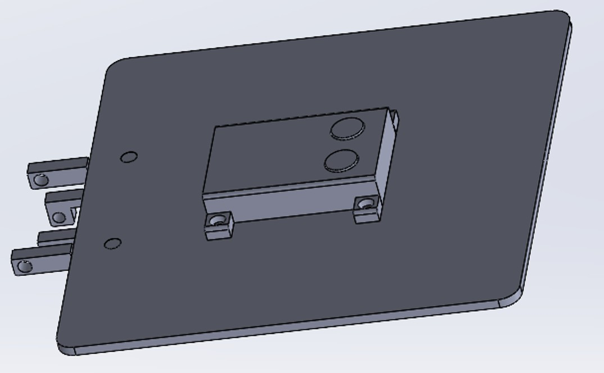
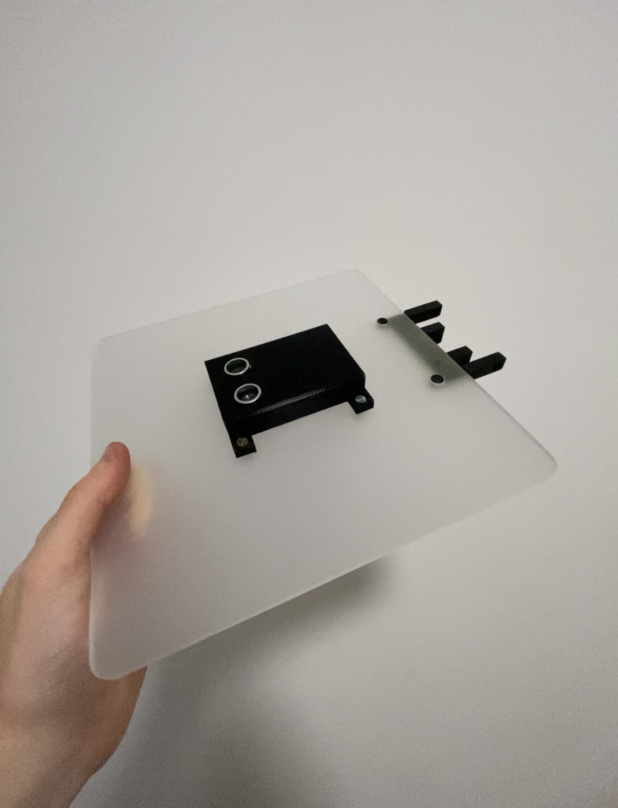
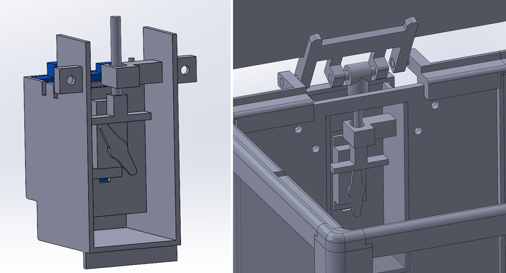
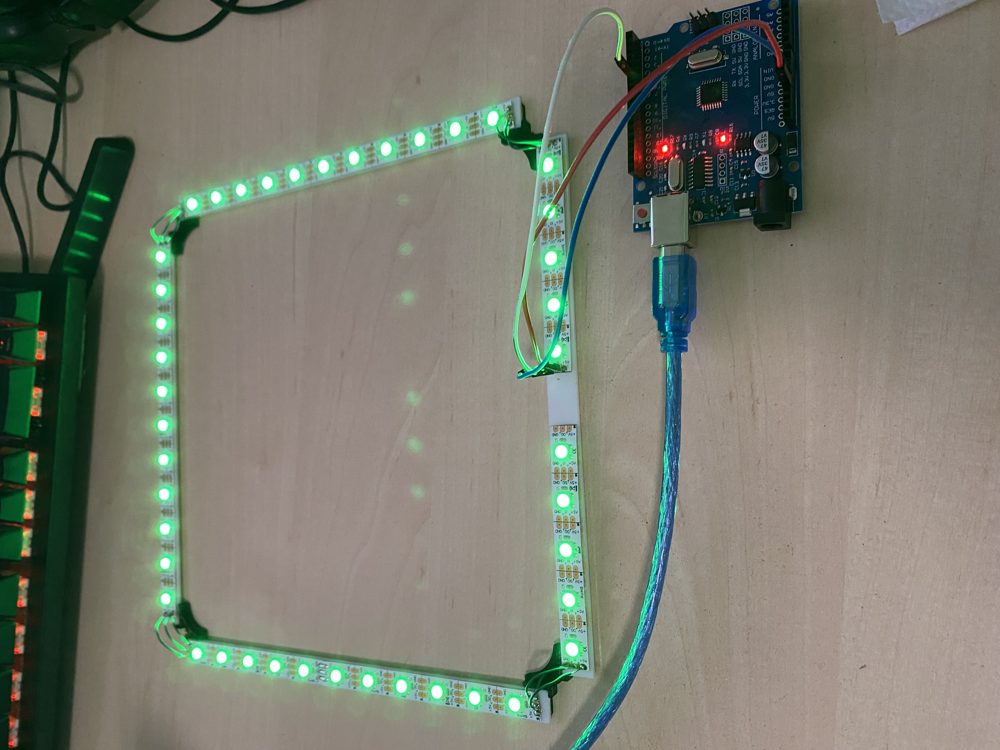

+++
date = '2025-09-22T14:39:09+02:00'
draft = false
title = 'Semestrální projekt'
menu = "main"
weight=7
featured = true
+++
### Pokojový odpadkový koš
<!--more-->
# První nápad
Pro téma svého semestrálního projektu jsem si zvolil **pokojový odpadkový koš**. Koš by měl mít vrchní otevírací víko, u kterého bude zabudovaný pohybový senzor (asi VL53L0X), jenž dokáže rozpoznat pohyb ruky. Tím by vyslal signál do Arduina, které by pomocí servomotoru (konkrétní typ by se zvolil podle váhy víka) otevřelo víko. Další senzor by byl zabudovaný pravděpodobně z vnitřní strany víka, který by měřil hladinu odpadu v koši. Na koš bych tedy dále zabudoval buď jednoduchou obrazovku (mohla by stačit LED matice nebo LCD obrazovka), která by mohla ukazovat procenta hladiny odpadu, případně by se napsala zpráva při vyhození odpadu. Napájení bych chtěl řešit powerbankou, ale záleží na finální náročnosti zapojení. 

# Specifikace práce

## Elektronika
Na koš jsem z elektronických komponent využil Arduino UNOR3 CH340 klon, 2x ultrazvukový měřič vzdálenosti HC-SR04, servo MG995 kontinuální (360°) s kovovými převody a silou 12kg a metr LED pásku. 
## Materiály
Na strany koše jsem využil **poloprůsvítné plexisklo** o tloušťce 5 mm. Na vnitřní koš jsem použil **karton** o tloušťce 6 mm. Rám LED pásku a víko koše jsem vyrobil z **bílého plexiskla** tloušťce 2 mm. Ostatní komponenty mého projektu byly vyrobeny 3D tiskem z černého **PETG**. 
## Finální funkce
Hlavní funkcí koše je samootevírací víko při **přejetí rukou nad víkem**. Další funkcí koše jsou světelné módy podsvícení a mód na vynesení odpadu. U prvního návrhu jsem přemýšlel nad indikací funkcí pomocí obrazovky, ale nakonec jsem zvolil světelnou indikaci pomocí LED pásku. 

**První snímač**, namířený z víka, slouží k rozpoznání pohybu ruky. Ve svém programu jsem nastavil, že se vyšle signál při registraci vzdálenosti menší než 400 mm. **Druhý snímač** měří naplnění koše. Na zadní části se nachází tlačítko, které přepíná funkční módy. Při zapnutí je nastaven mód 1. 

**Mód 1** funguje následovně. Prázdný koš (vzdálenost od víka 300 mm) je indikován zelenou barvou podsvícení. Naopak plný koš (vzdálenost od víka 5 mm) je identifikován červenou barvou. Čím více je koš naplněn, tím více přechází zelená barva do červené. Pokud se chceme dostat z jiných módů k tomu prvnímu, tak stačí jednou zmáčknout tlačítko.


**Mód 2** se spustí při dvojitém zmáčknutí tlačítka. V tomto módu již druhý senzor neměří hladinu odpadu a podsvícení se postupně mění všemi barvami. Tento mód je zamýšlen jako doplněk k různým herním periferiím. 

**Mód 3** se spustí při podržení tlačítka déle než 5 sekund. V tomto módu se úplně vypne podsvícení. Tento mód je určen pro případ, kdy chce uživatel jít spát a nechce být rušen barevným světlem.



Poslední **mód 4** se spustí po zmáčknutí tlačítka 5x rychle za sebou. Při tomto módu se víko vyklopí o 90°. Po dosažení této úvratě se podsvícení rozsvítí modrou barvou. Víko vyčkává v této úvrati, dokud uživatel nezmáčkne jednou tlačítko. Tím se víko opět spustí do zavřené polohy. Tento mód je určený k vynesení vnitřního koše. Uživatel spustí tento mód, vynese přeplněný koš, dá jej zpět a zmáčkne tlačítko. 



# Realizace projektu
Po sepsání požadovaných funkcí jsem se vrhnul na navrhování projektu. Projekt jsem vytvářel v programu SOLIDWORKS, jelikož je mi nejpřirozenější. Projekt jsem rozdělil do 5 podsestav, kterými jsou: **Vnější rám, víko, domeček s elektronikou a zvedacím mechanismem, vnitřní koš, lišta s LED pásky a elektronika**. 

## Vnější rám
Jako první věc jsem navrhoval vnější rám, tedy největší rozměry koše. Věděl jsem, že chci mít stěny z plexiskla, tak jsem vytvořil rohy, do kterých se následně zapustilo plexisklo. Roh jsem pro tisk rozdělil celkem na tři části (noha, horní a dolní stěna). Na nohy rohu jsem ještě přidal držáky pro lištu s LED pásky. Na horní část rámu jsem navrhl lišty s vybráním pro víko a horní část rohu. Zadní horní lištu jsem rozdělil na dvě části. Tato lišta má na sobě držák pro osu víka. 

Na stěny jsem využil plexisklo, které jsem si nařezal do požadovaného tvaru na laserové řezačce. Zadní deska má navíc otvory pro šrouby a obdelníkovou díru pro domeček s elektronikou. 
Díly jsem k sobě přilepil lepidlem na plasty. 

## Víko
Na plochu víka jsem prvně vyzkoušel stejné poloprůsvitné plexisklo jako na stěny. Chtěl jsem tím pozvednout estetickou stránku koše. Při testech se však ukázalo, že je víko velice těžké a tak jsem jej nakonec vytvořil z tenkého bílého plexiskla. Ten už byl váhově ideální. Toto plexisklo má v sobě díry pro šrouby, na snímač hladiny odpadu, na vedení kabelů a na držák víka (spojení os velkého kola s víkem).

Na toto víko jsem vytvořil domeček pro snímače. Je v něm jak snímač pohybu ruky, tak snímač hladiny odpadu. Kabely od snímačů jsou vedeny pod víkem k domečku s elektronikou.

## Domeček s elektronikou a zvedacím mechanismem
Domeček jsem navrhoval hlavně s ohledem na to, aby byl při sestavení dobrý přístup k napájení arduina a aby se do domečku vešly všechny kabely a spojky.

V první verzi jsem zvedání víka realizoval **vačkovým mechanismem**. Při projektování se to jevilo jako nejsnazší řešení pro ideální výšku otevření koše. Při testech prototypu se však tato verze ukázala jako nefunkční. Servo nedokázalo přeprat velkou páku víka. Vyzkoušel jsem rukou o jakou výšku se víko dokáže zvednout tímto mechanismem, ale ukázalo se, že úhel zdvihu je v reálu mnohem menší než v návrhu. Proto jsem se nakonec rozhodl využít převod **ozubenými koly**. Díky tomu jsem byl schopen zajistit ideálnější převodový poměr, který dokázal zvednout mé víko. Také jsem byl schopen zvednout víko o 90°, což jsem využil při módu na vynesení koše.

## Vnitřní koš
Pro vnitřní koš jsem zvolil karton. Tento materiál jsem zvolil z důvodu, že jsme jej měli k dispozici již na dílčí úkol 2 a mně zbyla velká nevyužitá plocha. Desky jsem si nařezal na laserové řezačce a dále slepil lepidlem. Do horní části desek jsem vyřezal otvor pro držáky vnitřního koše na lištu rámu. 

Koš jsem rozdělil na **dvě části** z důvodu recyklace. Jelikož se jedná o pokojový koš tak předpokládám odpad papírový a plastový. Tato verze vnitřního koše má však nevýhodu, že hladina odpadu se měří pouze v části blíže k zadní stěně koše.

## Lišta s LED pásky
Na podsvícení jsem si vytvořil z proužků plexiskla a vytištěných spojovačů čtvercovou lištu. Na tu jsem nastříhal části LED pásku, které jsem k liště přilepil. Dále jsem v rozích zapájel spojení LED pásku.

## Elektronika
Se samotným zapojením elektroniky nebyl výraznější problém. Sestavu jsem si prvně vytvořil v **Tinkercadu** a na ní jsem testoval kód. Největší problém pro mě bylo napsání kódu. Naštěstí doba pokročila a umělá inteligence je schopna velice dobře převádět slova do kódu, takže jsem měl k dispozici osobního programátora. Před celkovou stavbou jsem si složil zapojení a otestoval na něm finální kód. Hlavní problémy byly zajistit vypnutí senzoru pro měření hladiny při otevírání víka a problikávání LED pásku, které bylo způsobeno nepřesností měření senzorem. V konečné fázi projektu bylo potřeba vyladit dobu zvedání a klesání víka, jelikož můj servomotor nedokáže pracovat v otáčkách, ale v době otáčení. 

Na začátku projektu jsem uvažoval nad napájením elektroniky přes **powerbanku**. Nakonec jsem se rozhodl pro napájení **nabíječkou**. Powerbanka byla schopna zapojení utáhnout, ale musel jsem výrazně snížit svítivost pásku. Proto jsem se nakonec rozhodl pro nabíječku, díky které je podsvícení výraznější.  

# Výsledek
Zde jsou fotografie finálního výrobku:

## Poděkování
Při tvorbě projektu jsem se radil se svými přáteli, bez kterých bych se mohl dlouho zaseknout na mrtvém bodě. Proto bych touto cestou rád poděkoval za užitečné rady a funkční nápady těmto lidem: **Jan Vítek, David Lokaj a Pavel Malivanek**.  
