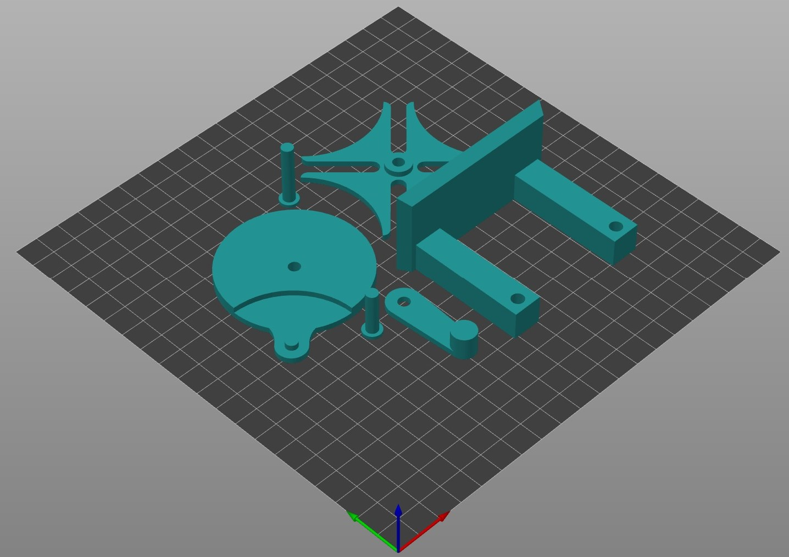
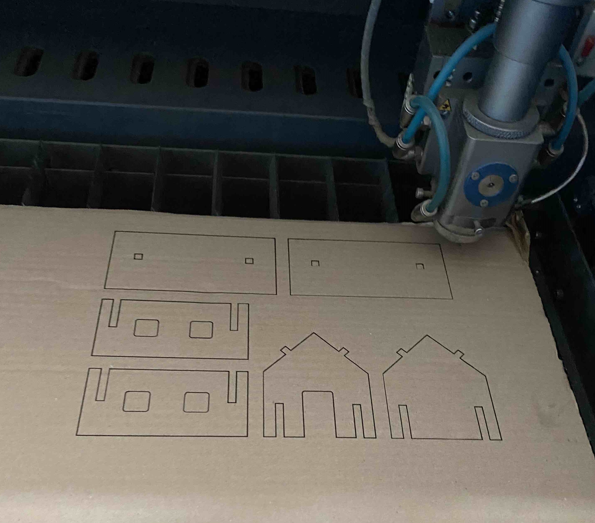

+++
date = '2025-09-22T14:39:09+02:00'
draft = false
title = 'Úkol č.3'
menu = "main"
weight=4
featured = true
+++

### 3D tisk
<!--more-->
V tomto úkolu jsme se měli vytvořit jednoduchý mechanismus a následně jej vytisknout na 3D tiskárnách v dílnách StrojLabu.

Zvolil jsem si mechanismus Maltézkého kříže. Když jsem se učil na střední škole v SOLIDWORKSu, tak byl tento mechanismus jako první sestava, co jsem kdy vytvářel. Proto jsem vybral tento mechanismus z nostalgie, a abych se zároveň porovnal, o jak moc rychleji jsem schopen tento mechanismus zkonstruovat.

Modely jsem vymodeloval v programu SOLIDWORKS. V místech volného uložení jsem zvolil vůli **0.5 mm** a pro uložení pro nalisování jsem zvolil vůli **0.1 mm**. Vytvořil jsem si i sestavu, abych měl jistotu, že vše pasuje tak jak má. Dále jsem otevřel program PrusaSlicer a přetáhl do něj své díly. Otočil jsem je tak, aby byl tisk co nejvýhodnější, a rozložení komponent po desce jsem nechal na programu. Materiál jsem zvolil **PLA** rudě červené barvy. Výplň tisku jsem nastavil na **15%** a výšku vrstvy **0.2 mm**. Nastavil jsem i tisk límce, protože měl program strach o stabilitu, pravděpodobně kvůli čepům. Tiskárnu jsem zvolil **Prusa i3**, jelikož byla zrovna volná a chuděrky se mi zželelo. Od svých spolužáků jsem totiž slyšel, že ji nikdy neviděli tisknout, tak jsem zvolil tisk na ní, aby se trochu protáhla. Tisk na této tiskárně trval něco málo pod 3 hodiny.
 

Tisk proběhl vesměs v pořádku. Při tisku první vrstvy se na desce vytvořil takový chuchvalec plastu, který jsem rukou odstranil. Poté již nenastaly žádné komplikace.
 

Když byl tisk hotov, tak jsem vyjmul desku s díly. Vizuálně vypadal tisk hezky. Díly jsem z podložky bez problémů odebral a očistil desku od límce. Dále následovalo sestavení mechanismu. Uložení vůle bylo zvoleno dobře, ale na nalisování už moc ne. Díly do sebe šly rukou nalisovat poměrně ztuha. V případných příštích tiscích bych ji zvolil minimálně o 0.05 mm větší. Mechanismus byl po sestavení funkční.
 
