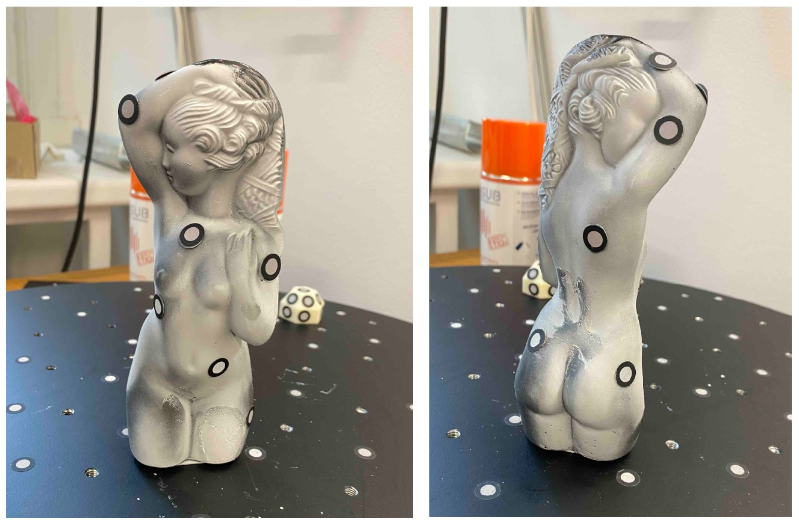

+++
date = '2025-09-22T14:39:09+02:00'
draft = false
title = 'Úkol č.4'
menu = "main"
weight=5
featured = true
+++

### 3D skenování
<!--more-->
Mým cílem bylo naskenovat a dále upravit výslednou síť modelu číslo **7** (soška).

Nejprve jsem si přečetl celý postup skenování a následně jsem se pustil do práce. Nejprve jsem naskenoval **kalibrační desku**, aby si sken spočítal přesnost měření. Poté jsem ve stromu v programu zvolil atributy dle prezentace. Má soška byla leskle černá a poměrně malá. Na sošku jsem nalepil **referenční body** a položil ji na podložku. Nejprve jsem zkusil objekt naskenovat **bez nanesení laku proti lesknutí**. Sken byl tímto způsobem velice nepřesný a nevzešlo z něj nic použitelného. 

Pro druhý sken jsem nanesl **lak proti lesku**. Zde jsem si neuvědomil, že při nanášení laku se zastříkají i referenční body. Ty byly tedy potřeba následně obměnit.

Nastříkaný díl šlo naskenovat mnohem lépe. Udělal jsem **dva celkové skeny**, které jsem následně nechal sloučit do jednoho modelu. S výsledným modelem jsem byl poměrně spokojený. Špatně se naskenoval pouze vršek sošky, který byl poměrně tvarově složitý, a spodek sošky. Výsledný sken jsem si uložil ve formátu **STL**, abych byl schopen jej dále upravovat.  

Následovalo upravování sítě. Nejprve jsem zadělal **díry po referenčních bodech**. Jednu díru jsem nebyl schopen zalepit, jelikož byla v místě, kde se soška špatně naskenovala. Poté jsem odřízl **pozůstatky po rovině**, na které stála má soška. Když už zbyl pouze model, tak jsem přešel na úpravu velikosti polygonů a vyhlatování. 

Dalším krokem bylo změřit obsah. Ten vyšel **21571,72 mm²**.

Dále jsem změřil maximální výšky modelu. Jelikoš spodní i horní část nebyla dokonale naskenována, tak jsem opticky zvolil nejnižší a nejvyšší bod. Tyto body jsem následne změřil a vyšlo **160,4 mm**.

Pro libovolný rozměr jsem zvolil vzdálenost mezi bradavkami (odborně **kozičková rozteč**). Na obou koncích jsem vytvořil body, které jsem následně změřil. Tento rozměr byl **21,5 mm**.
